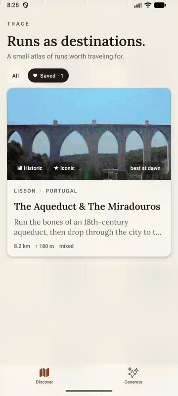
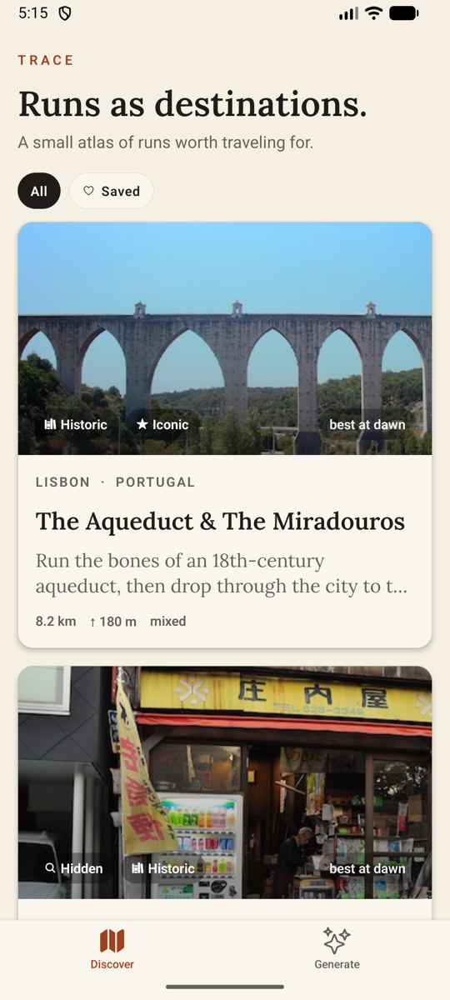
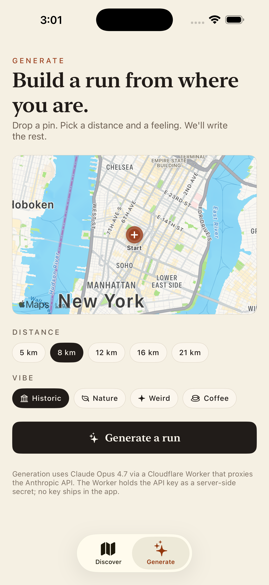
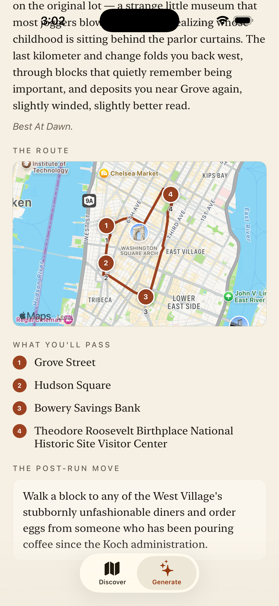

# Trace

A travel app for passionate runners. **Runs as destinations** — not routes overlaid on cities.

Built for the Atlas Obscura AI-Native Mobile & Product Engineer take-home.

This branch is the **cross-platform React Native rebuild** — one codebase running natively on **iOS and Android** — rebuilt from the original SwiftUI prototype (still included, see [The SwiftUI original](#the-swiftui-original)).

📄 [WRITEUP.md](WRITEUP.md) — the product reasoning behind what's here.
🏗 [docs/architecture.md](docs/architecture.md) — how the AI generator works under the hood.
🔁 [docs/rebuild.md](docs/rebuild.md) — what changed porting SwiftUI → React Native, and why.

<p align="center">
  
  <br/>
  <em>Running on Android — the curated feed, a run detail, then generating a run from a pin.</em>
</p>

| Discover | Generate | A run, generated end-to-end |
|---|---|---|
|  |  |  |
| The curated atlas. Real photos, AO-style cards. | Drop a pin, pick a distance and a vibe. | A real walking loop through real POIs, with Claude's writeup. |

## What it is

Two features, same on both platforms:

1. **Discover** — a curated, story-driven feed of iconic and hidden runs around the world. Each entry is hand-written in Atlas Obscura voice: a hook, a story, what you'll pass, a post-run move. Photos ship in the app.

2. **Generate** — drop a pin, pick a distance and a vibe, and the app builds a real walking-route loop, then writes an Atlas Obscura-style entry for it. POI discovery, walking-route stitching, and the writeup all happen **server-side** in a Cloudflare Worker (Google Places + Directions + Geocoding, then **Claude**), so iOS and Android produce identical results.

## How it's built

- **App** — React Native via **Expo (SDK 56)**, TypeScript, React Navigation, `react-native-maps` (Apple Maps on iOS, Google Maps on Android), Lora serif. One codebase, two platforms.
- **Backend** — a **Cloudflare Worker** ([`worker/`](worker/)) that owns the whole generation pipeline and holds the API keys as server-side secrets. Nothing sensitive ships in the app.
- **State** — local only: curated runs are bundled JSON; saved + generated runs persist via `AsyncStorage`. No accounts, no server state.

## Run it

```sh
cd mobile
npm install
npx expo run:ios          # iOS simulator — Apple Maps, no key needed
```

For Android, add a Google Maps SDK key (renders the map tiles) and run:

```sh
cp .env.example .env       # paste your Maps SDK for Android key
npx expo run:android
```

`react-native-maps` is a native module, so these are **development builds**, not Expo Go. The Generate tab calls the already-deployed Worker out of the box — no keys or backend setup needed to try it.

See [`mobile/README.md`](mobile/README.md) for physical-device builds, the signing setup, and the full layout.

## The SwiftUI original

Trace was first built as a native SwiftUI app; that version still lives in [`Trace/`](Trace/) on this branch (and is what `main` holds). The React Native app is a faithful port of its design and product. The Worker stays **backward-compatible** with the Swift app's contract, so both front-ends share one backend. See [docs/rebuild.md](docs/rebuild.md) for the port story and the key architectural change (MapKit on-device → server-side Google pipeline).

To run the SwiftUI version: `open Trace.xcodeproj` and ⌘R against an iOS 17+ simulator.

## Repo layout

```
.
├── README.md
├── WRITEUP.md
├── docs/
│   ├── architecture.md        ← the AI generation pipeline, end to end
│   ├── rebuild.md             ← SwiftUI → React Native port notes
│   └── notes.md               ← design calls, cuts, what's next
├── mobile/                    ← React Native (Expo) app — iOS + Android
│   ├── App.tsx                ← providers, fonts, tab + stack navigation
│   ├── app.config.ts          ← Expo config (Android Maps key, iOS signing)
│   ├── src/
│   │   ├── models/            ← Run, Waypoint, Vibe + helpers
│   │   ├── theme/             ← palette, type scale, vibe gradients
│   │   ├── data/              ← curated JSON, AsyncStorage store, hero images
│   │   ├── services/          ← AI client + offline mock
│   │   ├── components/        ← RunCard, HeroBanner, RouteMap, Chip, VibePill
│   │   └── screens/           ← Discover, Detail, Generate
│   └── plugins/               ← config plugin for iOS device signing
├── worker/                    ← Cloudflare Worker — the generation backend
│   └── src/                   ← index (handler), geo, google, claude
└── Trace/                     ← original SwiftUI app (iOS)
```

## Where to read

Fastest to depth, on the React Native side:

1. [mobile/src/models/run.ts](mobile/src/models/run.ts) — the domain model + display/geometry helpers.
2. [mobile/src/data/curatedRuns.json](mobile/src/data/curatedRuns.json) — the 5 hand-written runs.
3. [mobile/src/services/aiService.ts](mobile/src/services/aiService.ts) — the AI client contract + offline `MockAIService`.
4. [worker/src/index.ts](worker/src/index.ts) — the generation pipeline: POI search → route → measure/adjust → Claude.
5. [worker/src/geo.ts](worker/src/geo.ts) — POI selection (angular spread) and loop ordering.
6. [mobile/src/screens/DetailScreen.tsx](mobile/src/screens/DetailScreen.tsx) — the editorial detail screen.

[docs/architecture.md](docs/architecture.md) has the full pipeline diagram and the design decision behind each stage.

## What's not here yet

No accounts, no Strava import, no social, no onboarding, no settings, no live GPS recording, no automated tests.

The brief was "make one slice feel great." This slice is _runs as destinations + AI-authored runs grounded in real geography, on every phone._ Everything else got cut to spend the time on the editorial bar of the curated content and the generation pipeline.
